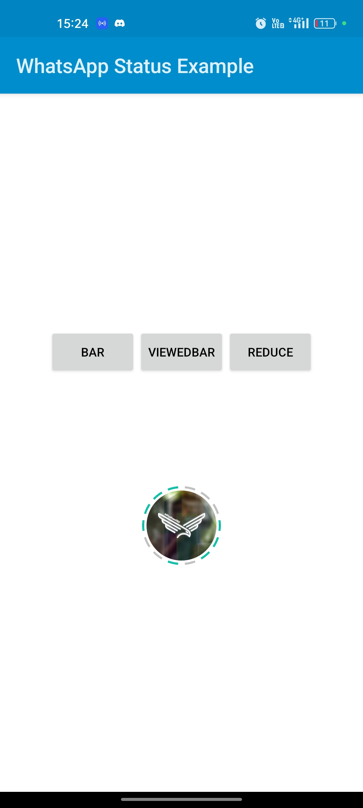
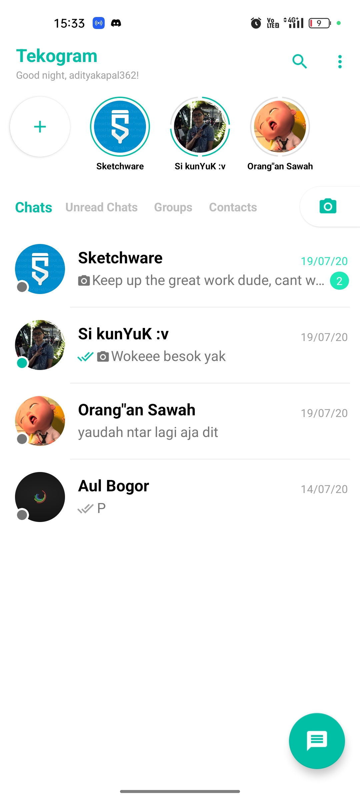

# ArcStatusBar
<p align="center">

</p>
<p>A simple and lightweight whatsapp-like-status-bar that fully customizable.</p>
<p><b>ArcStatusBar</b> is a custom Android View that visually represents a user's status (e.g., stories) using customizable arc-based bars, similar to the status bars in WhatsApp or Instagram. It supports features such as viewing/unviewing bars, dynamic updates, and XML or programmatic integration.</p>

## Features
- **Customizable Bars:** Configure bar width, colors, and gap sizes.
- **Dynamic Updates:** Add, remove, view, or unview bars programmatically.
- **XML and Programmatic Usage:** Can be used directly in XML layouts or instantiated programmatically.
- **Circular Design:** Bars are rendered in a circular pattern with a transparent center.

## Preview
<p align="center">


</p>

## Installation
1. **Add the class to your project:**
   Copy the `ArcStatusBar` class into your project.

2. **Add to your layout XML:**
   ```xml
   <com.adityakapal362.statusbar.ArcStatusBar
       android:id="@+id/arc_status_bar"
       android:layout_width="100dp"
       android:layout_height="100dp"
       android:background="@android:color/transparent" />
   ```

3. **Instantiate Programmatically:**
   ```java
   ArcStatusBar arcStatusBar = new ArcStatusBar(context);
   arcStatusBar.setLayoutParams(new LinearLayout.LayoutParams(100, 100));
   arcStatusBar.setData(yourArcDataList);
   ```

## XML Attributes (Optional)
You can extend `ArcStatusBar` to support custom XML attributes. Here's an example of supported attributes you could implement:
```xml
<declare-styleable name="ArcStatusBar">
    <attr name="barColor" format="color" />
    <attr name="viewedBarColor" format="color" />
    <attr name="barWidth" format="dimension" />
    <attr name="viewedBarWidth" format="dimension" />
</declare-styleable>
```

To use them:
```xml
<com.adityakapal362.statusbar.ArcStatusBar
    android:id="@+id/arc_status_bar"
    android:layout_width="100dp"
    android:layout_height="100dp"
    app:barColor="@color/unviewed"
    app:viewedBarColor="@color/viewed"
    app:barWidth="5dp"
    app:viewedBarWidth="3dp" />
```

---

## Example Project
Here is how you can use `ArcStatusBar` in an activity:
```java
ArcStatusBar arcStatusBar = findViewById(R.id.arc_status_bar);

// Set data
ArrayList<ArcData> data = new ArrayList<>();
data.add(new ArcData(false));
data.add(new ArcData(true));
arcStatusBar.setData(data);

// Customize colors and appearance
arcStatusBar.setBarGap(2f);
arcStatusBar.setBarColor(Color.RED);
arcStatusBar.setViewedBarColor(Color.GRAY);
arcStatusBar.setBaseColor(Color.TRANSPARENT);
arcStatusBar.setBarWidth(8);
arcStatusBar.setViewedBarWidth(5);
```

## Requirements
- **Minimum SDK:** Android 4.1 (API 16)
- **Language:** Java

## Contributing
Contributions are welcome! If you'd like to report an issue, suggest a feature, or submit a pull request, feel free to contribute to the repository.

## License
This project is licensed under the [GPL-3.0 License](LICENSE).
