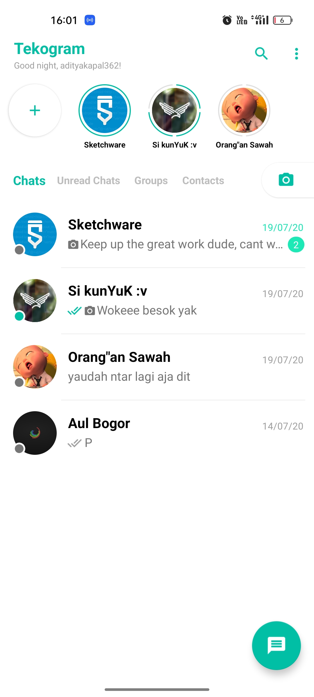

# ArcStatusBar
<p align="center">

</p>
<p>A simple and lightweight whatsapp-like-status-bar that fully customizable.</p>
<p><b>ArcStatusBar</b> is a custom Android View that visually represents a user's status (e.g., stories) using customizable arc-based bars, similar to the status bars in WhatsApp or Instagram. It supports features such as viewing/unviewing bars, dynamic updates, and XML or programmatic integration.</p>

## Features
- **Customizable Bars:** Configure bar width, colors, and gap sizes.
- **Dynamic Updates:** Add, remove, view, or unview bars programmatically.
- **XML and Programmatic Usage:** Can be used directly in XML layouts or instantiated programmatically.
- **Circular Design:** Bars are rendered in a circular pattern with a transparent center.

## Preview
<p align="center">


</p>

## Installation
1. **Add the class to your project:**
   Copy the `ArcStatusBar` class into your project.

2. **Add to your layout XML:**
   ```xml
   <com.adityakapal362.statusbar.ArcStatusBar
       android:id="@+id/arc_status_bar"
       android:layout_width="100dp"
       android:layout_height="100dp"
       android:background="@android:color/transparent" />
   ```

3. **Instantiate Programmatically:**
   ```java
   ArcStatusBar arcStatusBar = new ArcStatusBar(context);
   arcStatusBar.setLayoutParams(new LinearLayout.LayoutParams(100, 100));
   arcStatusBar.setData(yourArcDataList);
   ```

## Usage
### 1. **Add or Set Data**
Set the `ArcStatusBar` data using an `ArrayList` of `ArcData`:
```java
ArrayList<ArcData> data = new ArrayList<>();
data.add(new ArcData(false)); // Unviewed bar
data.add(new ArcData(true));  // Viewed bar

arcStatusBar.setData(data);

// if u dont want to make an ArrayList
// u can use this instead:
arcStatusBar.addBar();
// this will add an unviewed bar

// this will add a viewed bar
arcStatusBar.addBar(true);

// use this to remove specific bar
arcStatusBar.removeBar(position);

// use this to remove all bars
arcStatusBar.removeAllBar();
```

### 2. **View or Unview Bars**
Mark a specific bar as viewed or unviewed using:
```java
arcStatusBar.viewBar(position);   // Mark bar at 'position' as viewed
arcStatusBar.unviewBar(position); // Mark bar at 'position' as unviewed

// use this to view all bars
arcStatusBar.setAllBarViewed();
// use this to unview all bars
arcStatusBar.setAllBarUnviewed();

// get if bar viewed or not
boolean isViewed = arcStatusBar.isBarViewed(position);
```

### 3. **Customize Appearance**
You can customize the bar's appearance programmatically:
```java
arcStatusBar.setBarColor(Color.GREEN);
// Change unviewed bar color

arcStatusBar.setViewedBarColor(Color.GRAY);
// Change viewed bar color

arcStatusBar.setBarWidth(5);
// Set bar width

arcStatusBar.setViewedBarWidth(3);
// Set viewed bar width

arcStatusBar.setBarGap(4f);
// Set gap each bars

arcStatusBar.getBarWidth()
// Return bar width in integer

arcStatusBar.getViewedBarWidth()
// Return viewed bar width in integer

arcStatusBar.getBarGap()
// Return bar gap in float
```

## XML Attributes (Optional)
You can extend `ArcStatusBar` to support custom XML attributes. Here's an example of supported attributes you could implement:
```xml
<declare-styleable name="ArcStatusBar">
    <attr name="barColor" format="color" />
    <attr name="viewedBarColor" format="color" />
    <attr name="barWidth" format="dimension" />
    <attr name="viewedBarWidth" format="dimension" />
</declare-styleable>
```

To use them:
```xml
<com.adityakapal362.statusbar.ArcStatusBar
    android:id="@+id/arc_status_bar"
    android:layout_width="100dp"
    android:layout_height="100dp"
    app:barColor="@color/unviewed"
    app:viewedBarColor="@color/viewed"
    app:barWidth="5dp"
    app:viewedBarWidth="3dp" />
```

## Example Project
Here is how you can use `ArcStatusBar` in an activity:
```java
ArcStatusBar arcStatusBar = findViewById(R.id.arc_status_bar);

// Set data
ArrayList<ArcData> data = new ArrayList<>();
data.add(new ArcData(false));
data.add(new ArcData(true));
arcStatusBar.setData(data);

// Customize colors and appearance
arcStatusBar.setBarGap(2f);
arcStatusBar.setBarColor(Color.RED);
arcStatusBar.setViewedBarColor(Color.GRAY);
arcStatusBar.setBarWidth(4);
arcStatusBar.setViewedBarWidth(3);
```

## Requirements
- **Minimum SDK:** Android 4.1 (API 16)
- **Language:** Java

## Contributing
Contributions are welcome! If you'd like to report an issue, suggest a feature, or submit a pull request, feel free to contribute to the repository.

## License
This project is licensed under the [GPL-3.0 License](LICENSE).
